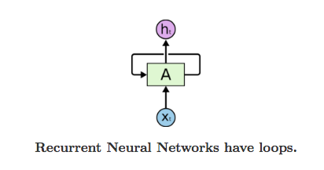
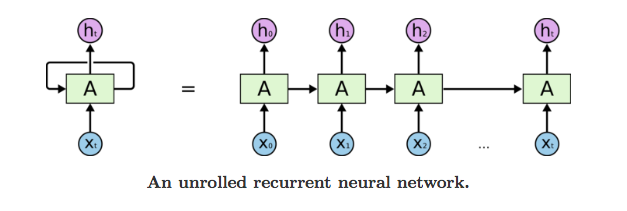
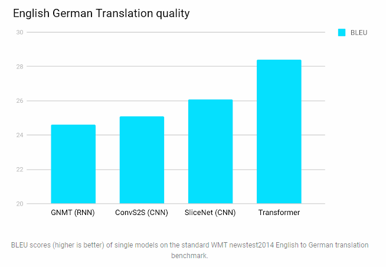
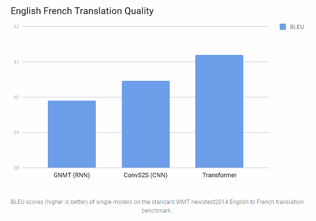
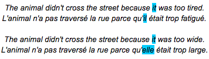
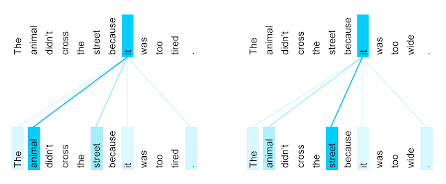
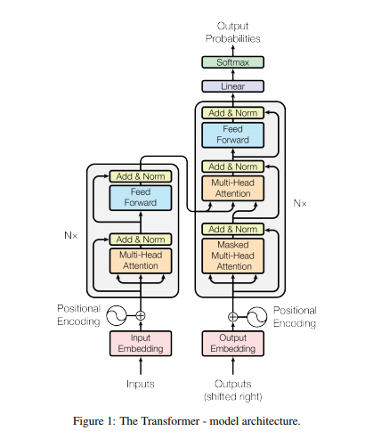

# Transformer - Attention is all you need

Neural networks usually process language by generating fixed- or variable-length vector-space representations. After starting with representations of individual words or even pieces of words, they aggregate information from surrounding words to determine the meaning of a given bit of language in context. For example, deciding on the most likely meaning and appropriate representation of the word “bank” in the sentence “I arrived at the bank after crossing the…” requires knowing if the sentence ends in “... road.” or “... river.”

Vaswani, Ashish et al. [“Attention Is All You Need.”](https://arxiv.org/abs/1706.03762) NIPS (2017) discusses the usage of 'attention' instead of [RNN](https://medium.com/explore-artificial-intelligence/an-introduction-to-recurrent-neural-networks-72c97bf0912), [LSTM](http://colah.github.io/posts/2015-08-Understanding-LSTMs/), and [GRU RNN](https://arxiv.org/abs/1706.02222). Google blog on [Transformer: A Novel Neural Network Architecture for Language Understanding](https://ai.googleblog.com/2017/08/transformer-novel-neural-network.html) discused this article.

Numerous efforts have been made to push the limits of these recurrent models and encoder-decoder architectures. What iw RNN? Let's review.

## RNN
Recurrent models have loops that allows information to persist.

In the above, a chunk of neural network, A, looks at some input $x_t$ and outputs a value $h_t$. A loop allows information to be passed from one step of the network to the next. A RNN can be thought of as multiple copies of the same network, each passing a message to a successor. Below represent the unrolled representation of this loop:

This chain-like nature reveals that recurrent neural networks are intimately related to sequences and lists. They’re the natural architecture of neural network to use for such data.

RNNs have in recent years become the typical network architecture for translation, processing language sequentially in a left-to-right or right-to-left fashion. Reading one word at a time, this forces RNNs to perform multiple steps to make decisions that depend on words far away from each other. Processing the example above, an RNN could only determine that “bank” is likely to refer to the bank of a river after reading each word between “bank” and “river” step by step. Prior research has shown that, roughly speaking, the more such steps decisions require, the harder it is for a recurrent network to learn how to make those decisions.

The sequential nature of RNNs also makes it more difficult to fully take advantage of modern fast computing devices such as TPUs and GPUs, which excel at parallel and not sequential processing. Convolutional neural networks (CNNs) are much less sequential than RNNs, but in CNN architectures like ByteNet or ConvS2S the number of steps required to combine information from distant parts of the input still grows with increasing distance.

## Transformer
The Transformer outperfomed both reccurrent and convolutional models on academic English to German and English to French translation bnechmark.

Transformer only performs a small, constant number of steps (chosen empirically). In each step, it applies a self-attention mechanism which directly models relationships between all words in a sentence, regardless of their respective position. In the earlier example “I arrived at the bank after crossing the river”, to determine that the word “bank” refers to the shore of a river and not a financial institution, the Transformer can learn to immediately attend to the word “river” and make this decision in a single step. In fact, in our English-French translation model we observe exactly this behavior.

More specifically, to compute the next representation for a given word - “bank” for example - the Transformer compares it to every other word in the sentence. The result of these comparisons is an attention score for every other word in the sentence. These attention scores determine how much each of the other words should contribute to the next representation of “bank”. In the example, the disambiguating “river” could receive a high attention score when computing a new representation for “bank”. The attention scores are then used as weights for a weighted average of all words’ representations which is fed into a fully-connected network to generate a new representation for “bank”, reflecting that the sentence is talking about a river bank.

The animation below illustrates how researchers at Google applied the Transformer to machine translation. Neural networks for machine translation typically contain an encoder reading the input sentence and generating a representation of it. A decoder then generates the output sentence word by word while consulting the representation generated by the encoder. The Transformer starts by generating initial representations, or embeddings, for each word. These are represented by the unfilled circles. Then, using self-attention, it aggregates information from all of the other words, generating a new representation per word informed by the entire context, represented by the filled balls. This step is then repeated multiple times in parallel for all words, successively generating new representations.

The decoder operates similarly, but generates one word at a time, from left to right. It attends not only to the other previously generated words, but also to the final representations generated by the encoder.

Flow of Information
Beyond computational performance and higher accuracy, another intriguing aspect of the Transformer is that we can visualize what other parts of a sentence the network attends to when processing or translating a given word, thus gaining insights into how information travels through the network.

To illustrate this, Google chos\ an example involving a phenomenon that is notoriously challenging for machine translation systems: coreference resolution. Consider the following sentences and their French translations:

It is obvious to most that in the first sentence pair “it” refers to the animal, and in the second to the street. When translating these sentences to French or German, the translation for “it” depends on the gender of the noun it refers to - and in French “animal” and “street” have different genders. In contrast to the current Google Translate model, the Transformer translates both of these sentences to French correctly. Visualizing what words the encoder attended to when computing the final representation for the word “it” sheds some light on how the network made the decision. In one of its steps, the Transformer clearly identified the two nouns “it” could refer to and the respective amount of attention reflects its choice in the different contexts.

Given this insight, it might not be that surprising that the Transformer also performs very well on the classic language analysis task of syntactic constituency parsing, a task the natural language processing community has attacked with highly specialized systems for decades.
In fact, with little adaptation, the same network we used for English to German translation outperformed all but one of the previously proposed approaches to constituency parsing.

## Details of Transformer

Left is the **Encoder** and **Right** is the decoder.

The encoder is composed of a saatck of N=6 identical layers that are in gray in above figure.
