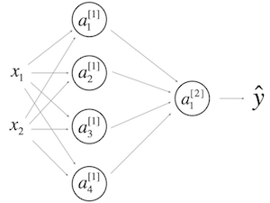

# 1. Question 1
Which of the following are true? (Check all that apply.)

- [x] $a^{[2]}_4$ is the activation output by the $4^{th}$ neuron of the $2^{nd}$  layer
- [ ] X is a matrix in which each row is one training example.
- [ ] $a^{[2](12)}$ denotes activation vector of the $12^{th}$ layer on the $2^{nd}$ training example.
- [x] X is a matrix in which each column is one training example.
- [ ] $a^{[2]}_4$ is the activation output of the $2^{nd}$ layer for the $4^{th}$ training example
- [x] $a^{[2]}$ denotes the activation vector of the $2^{nd}$ layer.
- [x] $a^{[2](12)}$ denotes the activation vector of the $2^{nd}$ layer for the $12^{th}$  training example.

# 2. Question 2
The tanh activation usually works better than sigmoid activation function for hidden units because the mean of its output is closer to zero, and so it centers the data better for the next layer. True/False?

- [x] True
- [ ] False

# 3. Question 3
Which of these is a correct vectorized implementation of forward propagation for layer *l*, where $1 \leq l \leq L$?


- [x] $Z^{[l]} = W^{[l]} A^{[l-1]}+ b^{[l]}$

&nbsp;&nbsp;&nbsp;&nbsp;&nbsp;&nbsp;&nbsp;$A^{[l]} = g^{[l]}(Z^{[l]})$

- [ ] $Z^{[l]} = W^{[l]} A^{[l]}+ b^{[l]}$

&nbsp;&nbsp;&nbsp;&nbsp;&nbsp;&nbsp;&nbsp;$A^{[l+1]} = g^{[l]}(Z^{[l]})$

- [ ] $Z^{[l]} = W^{[l]} A^{[l]}+ b^{[l]}$

&nbsp;&nbsp;&nbsp;&nbsp;&nbsp;&nbsp;&nbsp;$A^{[l+1]} = g^{[l+1]}(Z^{[l]})$

- [ ] $Z^{[l]} = W^{[l-1]} A^{[l]}+ b^{[l-1]}$

&nbsp;&nbsp;&nbsp;&nbsp;&nbsp;&nbsp;&nbsp;$A^{[l]} = g^{[l]}(Z^{[l]})$

# 4. Question 4
You are building a binary classifier for recognizing cucumbers (y=1) vs. watermelons (y=0). Which one of these activation functions would you recommend using for the output layer?

- [ ] ReLU
- [ ] Leaky ReLU
- [x] sigmoid
- [ ] tanh

# 5. Question 5
Consider the following code:

```python
A = np.random.randn(4,3)
B = np.sum(A, axis = 1, keepdims = True)
```
What will be B.shape? (If you’re not sure, feel free to run this in python to find out).

- [ ] (1, 3)
- [ ] (4, )
- [ ] (, 3)
- [x] (4, 1)

# 6. Question 6
Suppose you have built a neural network. You decide to initialize the weights and biases to be zero. Which of the following statements is true?

- [x] Each neuron in the first hidden layer will perform the same computation. So even after multiple iterations of gradient descent each neuron in the layer will be computing the same thing as other neurons.
- [ ] Each neuron in the first hidden layer will perform the same computation in the first iteration. But after one iteration of gradient descent they will learn to compute different things because we have “broken symmetry”.
- [ ] Each neuron in the first hidden layer will compute the same thing, but neurons in different layers will compute different things, thus we have accomplished “symmetry breaking” as described in lecture.
- [ ] The first hidden layer’s neurons will perform different computations from each other even in the first iteration; their parameters will thus keep evolving in their own way.

# 7. Question 7
Logistic regression’s weights w should be initialized randomly rather than to all zeros, because if you initialize to all zeros, then logistic regression will fail to learn a useful decision boundary because it will fail to “break symmetry”, True/False?

- [ ] True
- [x] False

# 8. Question 8
You have built a network using the tanh activation for all the hidden units. You initialize the weights to relative large values, using np.random.randn(..,..)*1000. What will happen?

- [ ] This will cause the inputs of the tanh to also be very large, thus causing gradients to also become large. You therefore have to set \alphaα to be very small to prevent divergence; this will slow down learning.

- [X] This will cause the inputs of the tanh to also be very large, thus causing gradients to be close to zero. The optimization algorithm will thus become slow.

- [ ] It doesn’t matter. So long as you initialize the weights randomly gradient descent is not affected by whether the weights are large or small.

- [ ] This will cause the inputs of the tanh to also be very large, causing the units to be “highly activated” and thus speed up learning compared to if the weights had to start from small values.

9. Question 9
Consider the following 1 hidden layer neural network:



Which of the following statements are True? (Check all that apply).

- [ ] $W^{[1]}$ will have shape (2, 4)
- [x] $b^{[1]}$ will have shape (4, 1)
- [x] $W^{[1]}$ will have shape (4, 2)
- [ ] $b^{[1]}$ will have shape (2, 1)
- [x] $W^{[2]}$ will have shape (1, 4)
- [ ] $b^{[2]}$ will have shape (4, 1)
- [ ] $W^{[2]}$ will have shape (4, 1)
- [x] $b^{[2]}$ will have shape (1, 1)

# 10. Question 10
In the same network as the previous question, what are the dimensions of $Z^{[1]}$ and $A^{[1]}$?

- [ ] $Z^{[1]}$ and $A^{[1]}$ are (4,1)
- [X] $Z^{[1]}$ and $A^{[1]}$ are (4,m)
- [ ] $Z^{[1]}$ and $A^{[1]}$ are (4,2)
- [ ] $Z^{[1]}$ and $A^{[1]}$ are (1,4)

Remember that $Z^{[1]}$ and $A^{[1]}$ are quantities computed over a batch of training examples, not only 1
