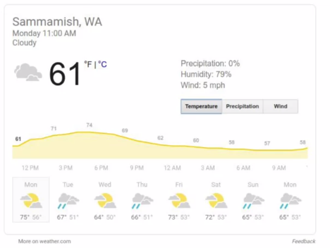
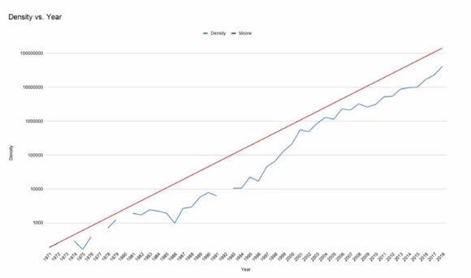
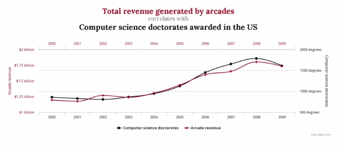
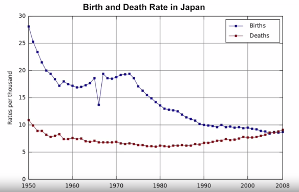
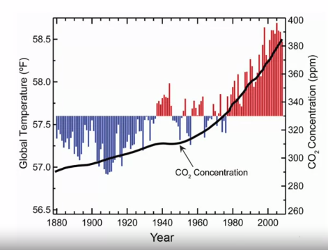
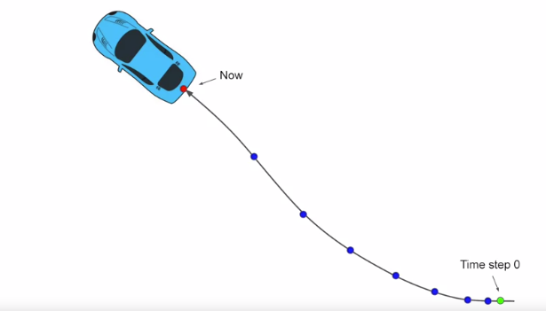
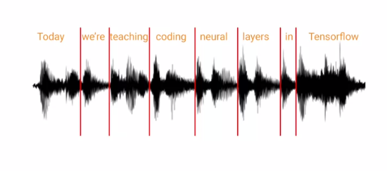

# Time series Examples

## Stock Praice

## weather forcast

## Moore's law

 the number of transistors per square millimeter, grouped chip releases by year, and the Moore's law trend line from the first data item.

## spurious-correlations
https://www.tylervigen.com/spurious-correlations

## Birth and death rate in Japan

## Co2/ Temperature

## Movement
Movement of a body can also be plotted as a series of univariates or as a combined multivariate. Consider, for example, the path of a car as it travels. A time step zero is at a particular latitude and longitude. As subsequent time steps, these values changed based on the path of the car. The acceleration of the car, in other words, it's not moving at a constant speed, means that the spaces between the time steps also change in size, in this case getting larger. But what if we were to plot the direction of the car as univariates. Based on its heading, we could see that the longitude of the car decreases over time, but its latitude increases, and as such you will get charts like these.

## Use of ML in timeseries

- predict future
- predict past
- detect anormaly
- analyze the time series to spot patterns in them that determine what generated the series itself.
- speech recognition

