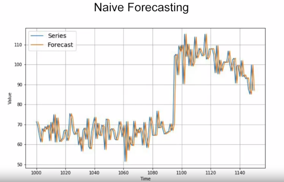
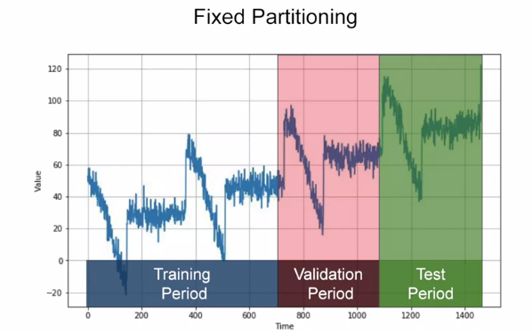
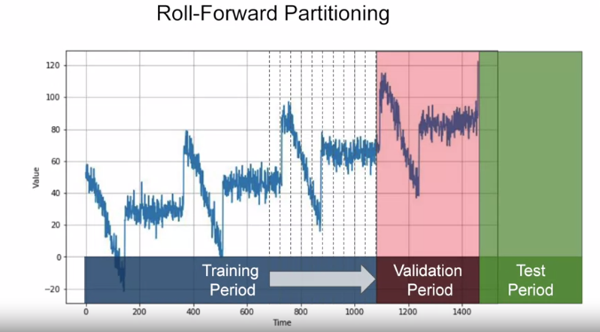

# Train, validation and test sets

## Naive forcasting
take the last value and assume that the next value will be the same one, and this is called naive forecasting.

## Fixed Partitioning

## Roll forward Partitioning
 We start with a short training period, and we gradually increase it, say by one day at a time, or by one week at a time. At each iteration, we train the model on a training period. And we use it to forecast the following day, or the following week, in the validation period.

