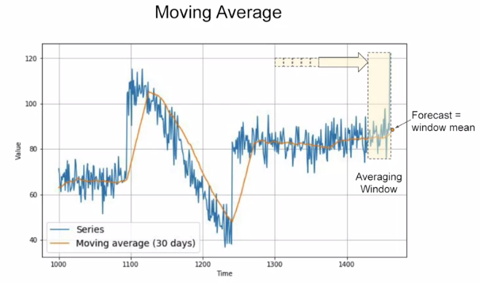
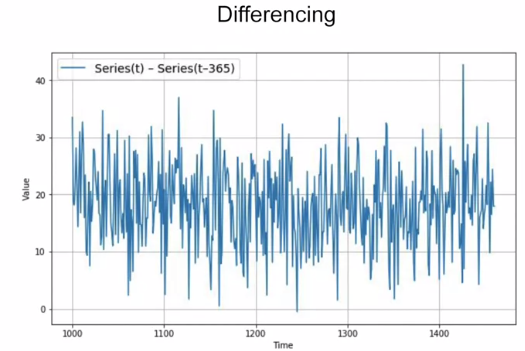
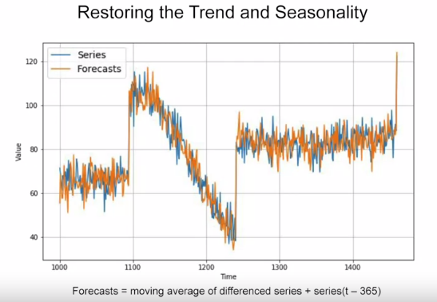
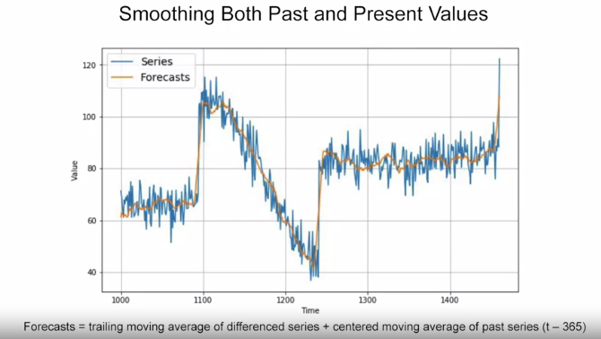

# Moving average and differencing

This is the intuitive

A common and very simple forecasting method is to calculate a moving average. The idea here is that the yellow line is a plot of the average of the blue values over a fixed period called an averaging window, for example, 30 days. Now this nicely eliminates a lot of the noise and it gives us a curve roughly emulating the original series, but it does not anticipate trend or seasonality. Depending on the current time i.e. the period after which you want to forecast for the future, it can actually end up being worse than a naive forecast. In this case, for example, I got a mean absolute error of about 7.14.

One method to avoid this is to remove the trend and seasonality from the time series with a technique called differencing. So instead of studying the time series itself, we study the difference between the value at time T and the value at an earlier period. Depending on the time of your data, that period might be a year, a day, a month or whatever. Let's look at a year earlier. So for this data, at time T minus 365, we'll get this difference time series which has no trend and no seasonality. We can then use a moving average to forecast this time series which gives us these forecasts.

 But these are just forecasts for the difference time series, not the original time series. To get the final forecasts for the original time series, we just need to add back the value at time T minus 365, and we'll get these forecasts.
 

  If we measure the mean absolute error on the validation period, we get about 5.8. So it's slightly better than naive forecasting but not tremendously better. You may have noticed that our moving average removed a lot of noise but our final forecasts are still pretty noisy. Where does that noise come from? Well, that's coming from the past values that we added back into our forecasts. So we can improve these forecasts by also removing the past noise using a moving average on that.

  

   this gives us a mean squared error over the validation period of just about 4.5
