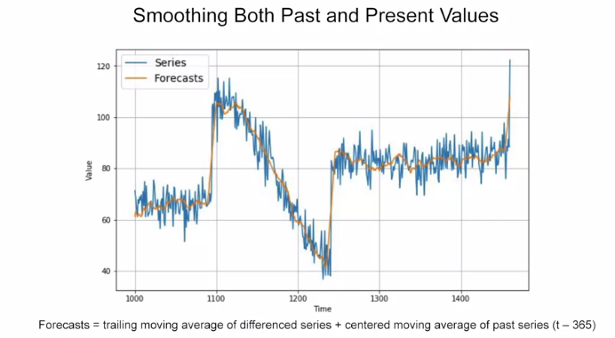

# Trailing versus centered windows

Note that when we use the trailing window when computing the moving average of present values from t minus 32, t minus one. But when we use a centered window to compute the moving average of past values from one year ago, that's t minus one year minus five days, to t minus one year plus five days. Then moving averages using centered windows can be more accurate than using trailing windows. But we can't use centered windows to smooth present values since we don't know future values. However, to smooth past values we can afford to use centered windows.
