# Convolutions

## LSTM
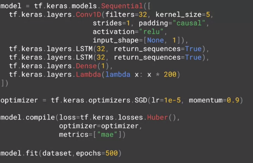


One important note is that while we got rid of the Lambda layer that reshaped the input for us to work with the LSTM's. So we're actually specifying an input shape on the curve 1D here.
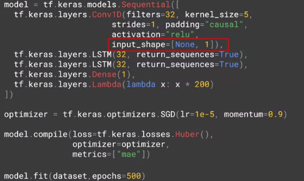

This requires us to update the windowed_datasetet helper function that we've been working with all along. We'll simply use tf.expand_ dims in the helper function to expand the dimensions of the series before we process it.
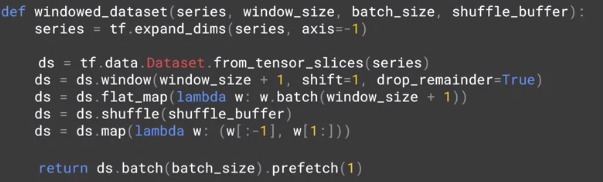

the code will attempt lots of different learning rates changing them epoch by epoch and plotting the results. With this data and the convolutional and LSTM-based network, we'll get a plot like this.

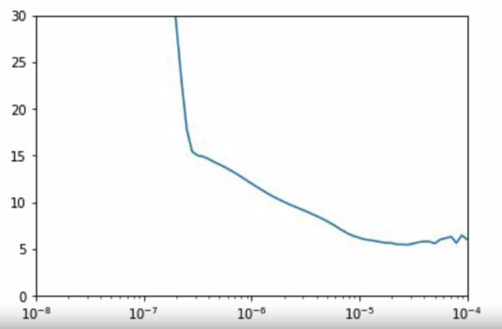

 It clearly bottoms are around 10 to the minus five after which it looks a bit unstable, so we'll take that to be our desired learning rates. Thus when we define the optimizer will set the learning rate to be 1e-5 as shown here.

 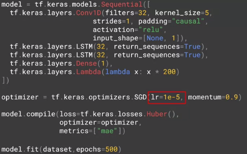

 When we train for 500 epochs we'll get this curve. It's a huge improvement over earlier. The peak has lost its plateau but it's still not quite right, it's not getting high enough relative to the data. Now of course noise is a factor and we can see crazy fluctuations in the peak caused by the noise, but I think our model could possibly do a bit better than this. Our MAE is below five, but I would bet that outside of that first peak is probably a lot lower than that. One solution might be to train a little bit longer. Even though our MAE loss curves look flat at 500 epochs, we can see when we zoom in that they're slowly diminishing.

 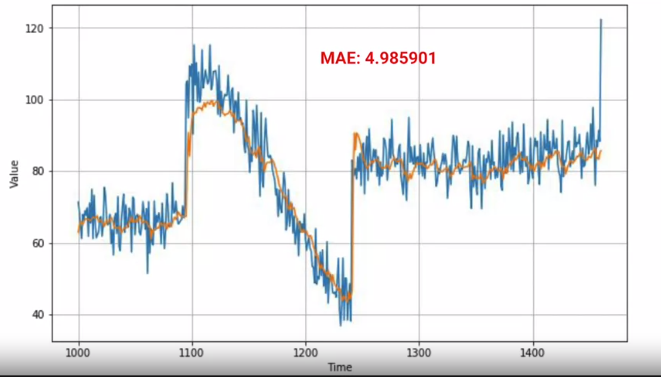

  One solution might be to train a little bit longer. Even though our MAE loss curves look flat at 500 epochs, we can see when we zoom in that they're slowly diminishing. The network is still learning albeit slowly.

  
Now one method would be to make your LASTMs bidirectional like this. When training, this looks really good giving very low loss in MAE values sometimes even less than one. But unfortunately it's overfittingng when we plot the predictions against the validation set, we don't see much improvement and in fact our MAE has gone down. So it's still a step in the right direction and consider an architecture like this one as you go forward, but perhaps you might need to tweak some of the parameters to avoid overfittingng.
  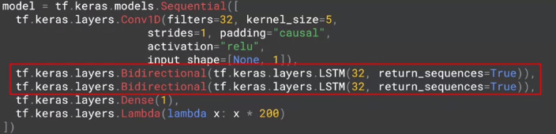
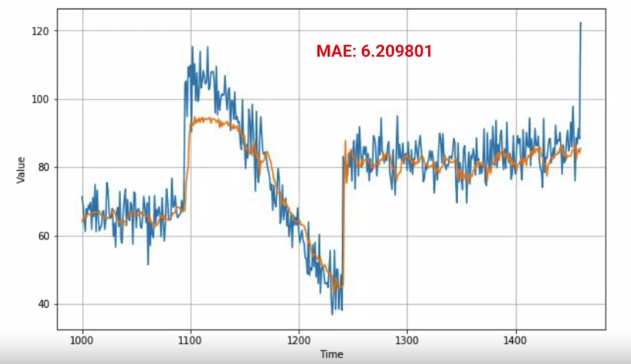

  Some of the problems are clearly visualize when we plot the loss against the MAE, there's a lot of noise and instability in there.   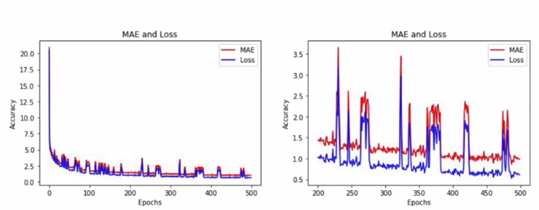
  One common cause for small spikes like that is a small batch size introducing further random noise. I won't go into the details here, but if you check out Andrea's videos and his course on optimizing for gradient descent, there's some really great stuff in there. One hint was to explore the batch size and to make sure it's appropriate for my data. So in this case it's worth experimenting with different batch sizes. So for example experimented with different batch sizes both larger and smaller than the original 32, and when I tried 16 you can see the impact here on the validation set, and here on the training loss and MAE data.
  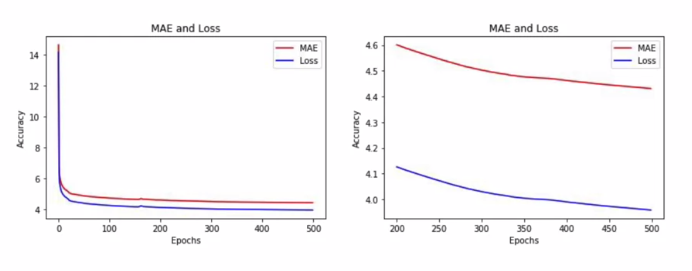


  So by combining CNNs and LSTMs we've been able to build our best model yet, despite some rough edges that could be refined.

## Example

```Python
import tensorflow as tf
import numpy as np
import matplotlib.pyplot as plt
print(tf.__version__)
```

```Python
def plot_series(time, series, format="-", start=0, end=None):
    plt.plot(time[start:end], series[start:end], format)
    plt.xlabel("Time")
    plt.ylabel("Value")
    plt.grid(True)

def trend(time, slope=0):
    return slope * time

def seasonal_pattern(season_time):
    """Just an arbitrary pattern, you can change it if you wish"""
    return np.where(season_time < 0.4,
                    np.cos(season_time * 2 * np.pi),
                    1 / np.exp(3 * season_time))

def seasonality(time, period, amplitude=1, phase=0):
    """Repeats the same pattern at each period"""
    season_time = ((time + phase) % period) / period
    return amplitude * seasonal_pattern(season_time)

def noise(time, noise_level=1, seed=None):
    rnd = np.random.RandomState(seed)
    return rnd.randn(len(time)) * noise_level

time = np.arange(4 * 365 + 1, dtype="float32")
baseline = 10
series = trend(time, 0.1)
baseline = 10
amplitude = 40
slope = 0.05
noise_level = 5

# Create the series
series = baseline + trend(time, slope) + seasonality(time, period=365, amplitude=amplitude)
# Update with noise
series += noise(time, noise_level, seed=42)

split_time = 1000
time_train = time[:split_time]
x_train = series[:split_time]
time_valid = time[split_time:]
x_valid = series[split_time:]

window_size = 20
batch_size = 32
shuffle_buffer_size = 1000
```

```Python
def windowed_dataset(series, window_size, batch_size, shuffle_buffer):
    series = tf.expand_dims(series, axis=-1)
    ds = tf.data.Dataset.from_tensor_slices(series)
    ds = ds.window(window_size + 1, shift=1, drop_remainder=True)
    ds = ds.flat_map(lambda w: w.batch(window_size + 1))
    ds = ds.shuffle(shuffle_buffer)
    ds = ds.map(lambda w: (w[:-1], w[1:]))
    return ds.batch(batch_size).prefetch(1)
def model_forecast(model, series, window_size):
    ds = tf.data.Dataset.from_tensor_slices(series)
    ds = ds.window(window_size, shift=1, drop_remainder=True)
    ds = ds.flat_map(lambda w: w.batch(window_size))
    ds = ds.batch(32).prefetch(1)
    forecast = model.predict(ds)
    return forecast
```


```Python
tf.keras.backend.clear_session()
tf.random.set_seed(51)
np.random.seed(51)

window_size = 30
train_set = windowed_dataset(x_train, window_size, batch_size=128, shuffle_buffer=shuffle_buffer_size)

model = tf.keras.models.Sequential([
  tf.keras.layers.Conv1D(filters=32, kernel_size=5,
                      strides=1, padding="causal",
                      activation="relu",
                      input_shape=[None, 1]),
  tf.keras.layers.Bidirectional(tf.keras.layers.LSTM(32, return_sequences=True)),
  tf.keras.layers.Bidirectional(tf.keras.layers.LSTM(32, return_sequences=True)),
  tf.keras.layers.Dense(1),
  tf.keras.layers.Lambda(lambda x: x * 200)
])
lr_schedule = tf.keras.callbacks.LearningRateScheduler(
    lambda epoch: 1e-8 * 10**(epoch / 20))
optimizer = tf.keras.optimizers.SGD(lr=1e-8, momentum=0.9)
model.compile(loss=tf.keras.losses.Huber(),
              optimizer=optimizer,
              metrics=["mae"])
history = model.fit(train_set, epochs=100, callbacks=[lr_schedule])
```


```Python
plt.semilogx(history.history["lr"], history.history["loss"])
plt.axis([1e-8, 1e-4, 0, 30])
```
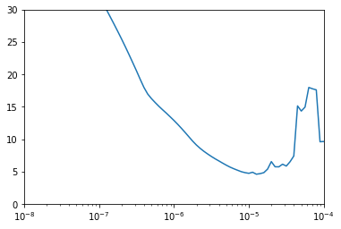

```Python
tf.keras.backend.clear_session()
tf.random.set_seed(51)
np.random.seed(51)
#batch_size = 16
dataset = windowed_dataset(x_train, window_size, batch_size, shuffle_buffer_size)

model = tf.keras.models.Sequential([
  tf.keras.layers.Conv1D(filters=32, kernel_size=3,
                      strides=1, padding="causal",
                      activation="relu",
                      input_shape=[None, 1]),
  tf.keras.layers.LSTM(32, return_sequences=True),
  tf.keras.layers.LSTM(32, return_sequences=True),
  tf.keras.layers.Dense(1),
  tf.keras.layers.Lambda(lambda x: x * 200)
])

optimizer = tf.keras.optimizers.SGD(lr=1e-5, momentum=0.9)
model.compile(loss=tf.keras.losses.Huber(),
              optimizer=optimizer,
              metrics=["mae"])
history = model.fit(dataset,epochs=500)
```


```Python
rnn_forecast = model_forecast(model, series[..., np.newaxis], window_size)
rnn_forecast = rnn_forecast[split_time - window_size:-1, -1, 0]
```


```Python
plt.figure(figsize=(10, 6))
plot_series(time_valid, x_valid)
plot_series(time_valid, rnn_forecast)
```
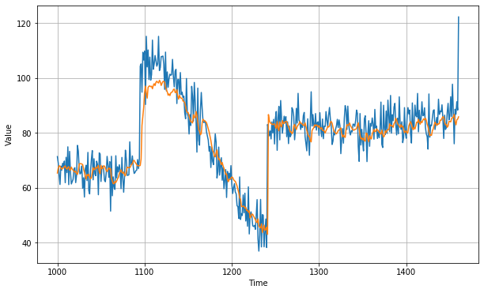

```Python
tf.keras.metrics.mean_absolute_error(x_valid, rnn_forecast).numpy()
```
5.0638213

```Python
import matplotlib.image  as mpimg
import matplotlib.pyplot as plt

#-----------------------------------------------------------
# Retrieve a list of list results on training and test data
# sets for each training epoch
#-----------------------------------------------------------
mae=history.history['mae']
loss=history.history['loss']

epochs=range(len(loss)) # Get number of epochs

#------------------------------------------------
# Plot MAE and Loss
#------------------------------------------------
plt.plot(epochs, mae, 'r')
plt.plot(epochs, loss, 'b')
plt.title('MAE and Loss')
plt.xlabel("Epochs")
plt.ylabel("Accuracy")
plt.legend(["MAE", "Loss"])

plt.figure()

epochs_zoom = epochs[200:]
mae_zoom = mae[200:]
loss_zoom = loss[200:]

#------------------------------------------------
# Plot Zoomed MAE and Loss
#------------------------------------------------
plt.plot(epochs_zoom, mae_zoom, 'r')
plt.plot(epochs_zoom, loss_zoom, 'b')
plt.title('MAE and Loss')
plt.xlabel("Epochs")
plt.ylabel("Accuracy")
plt.legend(["MAE", "Loss"])

plt.figure()
```

