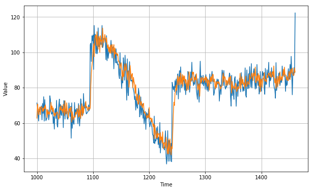
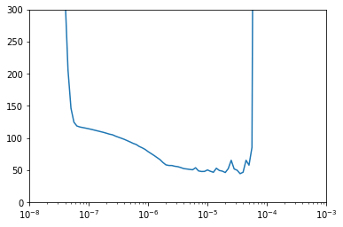
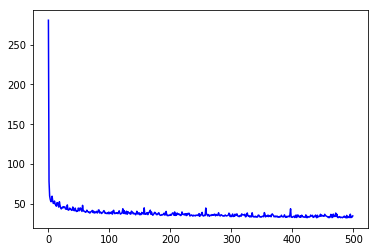
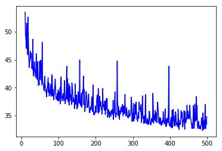
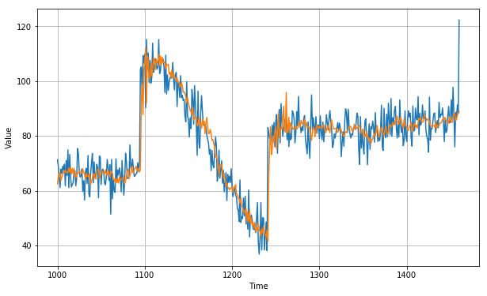

# Deep neural network training, tuning and prediction

```Python
!pip install tensorflow==2.0.0
import tensorflow as tf
import numpy as np
import matplotlib.pyplot as plt
print(tf.__version__)
```
2.0.0

```Python
def plot_series(time, series, format="-", start=0, end=None):
    plt.plot(time[start:end], series[start:end], format)
    plt.xlabel("Time")
    plt.ylabel("Value")
    plt.grid(True)

def trend(time, slope=0):
    return slope * time

def seasonal_pattern(season_time):
    """Just an arbitrary pattern, you can change it if you wish"""
    return np.where(season_time < 0.4,
                    np.cos(season_time * 2 * np.pi),
                    1 / np.exp(3 * season_time))

def seasonality(time, period, amplitude=1, phase=0):
    """Repeats the same pattern at each period"""
    season_time = ((time + phase) % period) / period
    return amplitude * seasonal_pattern(season_time)

def noise(time, noise_level=1, seed=None):
    rnd = np.random.RandomState(seed)
    return rnd.randn(len(time)) * noise_level

time = np.arange(4 * 365 + 1, dtype="float32")
baseline = 10
series = trend(time, 0.1)
baseline = 10
amplitude = 40
slope = 0.05
noise_level = 5

# Create the series
series = baseline + trend(time, slope) + seasonality(time, period=365, amplitude=amplitude)
# Update with noise
series += noise(time, noise_level, seed=42)

split_time = 1000
time_train = time[:split_time]
x_train = series[:split_time]
time_valid = time[split_time:]
x_valid = series[split_time:]

window_size = 20
batch_size = 32
shuffle_buffer_size = 1000
```


```Python
def windowed_dataset(series, window_size, batch_size, shuffle_buffer):
  dataset = tf.data.Dataset.from_tensor_slices(series)
  dataset = dataset.window(window_size + 1, shift=1, drop_remainder=True)
  dataset = dataset.flat_map(lambda window: window.batch(window_size + 1))
  dataset = dataset.shuffle(shuffle_buffer).map(lambda window: (window[:-1], window[-1]))
  dataset = dataset.batch(batch_size).prefetch(1)
  return dataset
```

First we'll have to get a data set which will generate by passing in x_train data, along with the desired window size, batch size, and shuffle buffer size.  Then build a three layers of 10, 10, and 1 neurons. The input shape is the size of the window and we'll activate each layer using a relu. We'll then compile the model as before with a mean squared error loss function and stochastic gradient descent optimizer. Finally, we'll fit the model over 100 epochs, and after a few seconds of training.
```Python
dataset = windowed_dataset(x_train, window_size, batch_size, shuffle_buffer_size)


model = tf.keras.models.Sequential([
    tf.keras.layers.Dense(10, input_shape=[window_size], activation="relu"),
    tf.keras.layers.Dense(10, activation="relu"),
    tf.keras.layers.Dense(1)
])

model.compile(loss="mse", optimizer=tf.keras.optimizers.SGD(lr=1e-6, momentum=0.9))
model.fit(dataset,epochs=100,verbose=0)


```
We'll see results that look like this.

```Python
forecast = []
for time in range(len(series) - window_size):
  forecast.append(model.predict(series[time:time + window_size][np.newaxis]))

forecast = forecast[split_time-window_size:]
results = np.array(forecast)[:, 0, 0]


plt.figure(figsize=(10, 6))

plot_series(time_valid, x_valid)
plot_series(time_valid, results)
```



 It's pretty good still. And when we calculate the mean absolute error, we're lower than we were earlier, so it's a step in the right direction.

```Python
tf.keras.metrics.mean_absolute_error(x_valid, results).numpy()
```
5.247058


 But it's also a somewhat a stab in the dark, particularly with the optimizer function. Wouldn't it be nice if we could pick the optimal learning rate instead of the one that we chose? We might learn more efficiently and build a better model. Now let's look at a technique for that that uses callbacks.


Here's a code for the previous neural network. But I've added a callback to tweak the learning rate using a learning rate scheduler. You can see that code here. This will be called at the callback at the end of each epoch. What it will do is change the learning rates to a value based on the epoch number. So in epoch 1, it is 1 times 10 to the -8 times 10 to the power of 1 over 20. And by the time we reach the 100 epoch, it'll be 1 times 10 to the -8 times 10 to the power of 5, and that's 100 over 20. This will happen on each callback because we set it in the callbacks parameter of modeled outfit.

```Python
dataset = windowed_dataset(x_train, window_size, batch_size, shuffle_buffer_size)


model = tf.keras.models.Sequential([
    tf.keras.layers.Dense(10, input_shape=[window_size], activation="relu"),
    tf.keras.layers.Dense(10, activation="relu"),
    tf.keras.layers.Dense(1)
])

lr_schedule = tf.keras.callbacks.LearningRateScheduler(
    lambda epoch: 1e-8 * 10**(epoch / 20))
optimizer = tf.keras.optimizers.SGD(lr=1e-8, momentum=0.9)
model.compile(loss="mse", optimizer=optimizer)
history = model.fit(dataset, epochs=100, callbacks=[lr_schedule], verbose=0)
```
After training with this, we can then plot the last per epoch against the learning rate per epoch by using this code, and we'll see a chart like this.
```Python
lrs = 1e-8 * (10 ** (np.arange(100) / 20))
plt.semilogx(lrs, history.history["loss"])
plt.axis([1e-8, 1e-3, 0, 300])
```
The y-axis shows us the loss for that epoch and the x-axis shows us the learning rate. We can then try to pick the lowest point of the curve where it's still relatively stable like this, and that's right around 7 times 10 to the -6.



So let's set that to be our learning rate and then we'll retrain. So here's the same neural network code, and we've updated the learning rate, so we'll also train it for a bit longer. Let's check the results after training for 500 epochs.
```Python
window_size = 30
dataset = windowed_dataset(x_train, window_size, batch_size, shuffle_buffer_size)

model = tf.keras.models.Sequential([
  tf.keras.layers.Dense(10, activation="relu", input_shape=[window_size]),
  tf.keras.layers.Dense(10, activation="relu"),
  tf.keras.layers.Dense(1)
])

optimizer = tf.keras.optimizers.SGD(lr=8e-6, momentum=0.9)
model.compile(loss="mse", optimizer=optimizer)
history = model.fit(dataset, epochs=500, verbose=0)
```

Here's the codes to plot out the loss that was calculated during the training, and it will give us a chart like this.
```Python
loss = history.history['loss']
epochs = range(len(loss))
plt.plot(epochs, loss, 'b', label='Training Loss')
plt.show()
```
Which upon first inspection looks like we're probably wasting our time training beyond maybe only 10 epochs, but it's somewhat skewed by the fact that the earlier losses were so high.



If we cropped them off and plot the loss for epochs after number 10 with code like this, then the chart will tell us a different story.

```Python
# Plot all but the first 10
loss = history.history['loss']
epochs = range(10, len(loss))
plot_loss = loss[10:]
print(plot_loss)
plt.plot(epochs, plot_loss, 'b', label='Training Loss')
plt.show()
```


We can see that the loss was continuing to decrease even after 500 epochs. And that shows that our network is learning very well indeed. And the results of the predictions overlaid against the originals looks like this.

```Python
forecast = []
for time in range(len(series) - window_size):
  forecast.append(model.predict(series[time:time + window_size][np.newaxis]))

forecast = forecast[split_time-window_size:]
results = np.array(forecast)[:, 0, 0]


plt.figure(figsize=(10, 6))

plot_series(time_valid, x_valid)
plot_series(time_valid, results)
```


And the mean absolute error across the results is significantly lower than earlier.
```Python
tf.keras.metrics.mean_absolute_error(x_valid, results).numpy()
```
