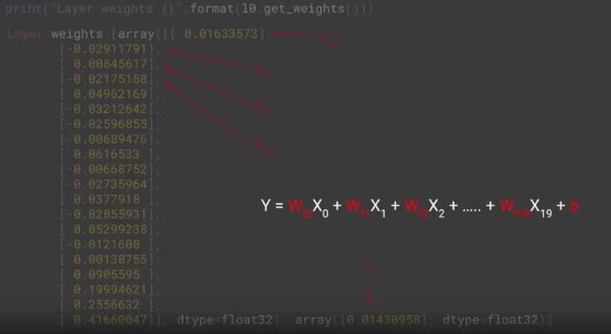
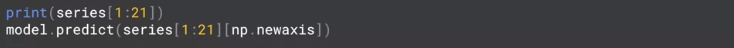
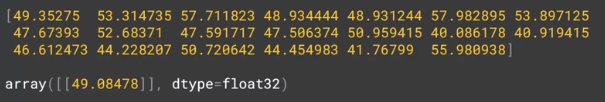
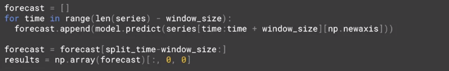
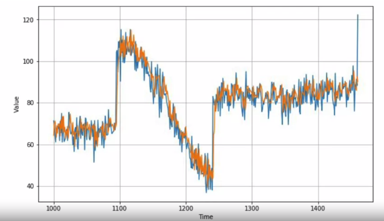
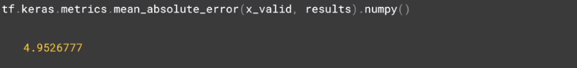

# Prediction

So now, if we look at the values again and see that these are the weights for the values at that particular timestamp and $b$ is the bias or the slope, we can do a standard linear regression like this to predict the value of $y$ at any step by multiplying out the $x$ values by the weights and then adding the bias.

So for example, if I take 20 items in my series and print them out, I can see the 20x values. If I want to predict them, I can pass that series into my model to get a prediction. The NumPy new axis then just reshapes it to the input dimension that's used by the model.

The output will look like this. The top array is the 20 values that provide the input to our model and the bottom is the predicted value back from the model.

So we've trained our model to say that when it sees 20 values like this, the predicted next value is `49.08478`.

If we want to plot our forecasts for every point on the time-series relative to the 20 points before it where our window size was 20, we can write code like this.

We create an empty list of forecasts and then iterate over the series taking slices and window size, predicting them, and adding the results to the forecast list. We had split our time series into training and testing sense taking everything before a certain time is training and the rest is validation. So we'll just take the forecasts after the split time and load them into a NuimPy array for charting. That chart looks like this with the actual values in blue and the predicted ones in orange.

You can see that our predictions look pretty good and getting them was relatively simple in comparison with all the statistical gymnastics. So let's measure the mean absolute error.

We can see that we're in a similar ballpark to where we were with a complex analysis that we did previously. Now that's just using a single layer in a neural network to calculate a linear regression.
