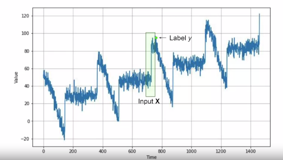

# Preparing features and labels

Our feature is effectively a number of values in the series, with our label being the next value.
 For example, if we take our time series data, say, 30 days at a time, we'll use 30 values as the feature and the next value is the label. Then over time, we'll train a neural network to match the 30 features to the single label.




## prep-featires-labels

Original file is located at
    https://colab.research.google.com/drive/1teVpIzaXibNUk_1JK5F0CVHOOvgegNgr

```python
!pip install tensorflow==2.0.0

import tensorflow as tf
print(tf.__version__)
import numpy as np
import matplotlib.pyplot as plt
```
2.0.0
```python
dataset = tf.data.Dataset.range(10)
for v in dataset:
  print(v.numpy())
```
```
0
1
2
3
4
5
6
7
8
9
```
### window the data into chunks of five items and shiftting by one each time.
```python
dataset = tf.data.Dataset.range(10)
dataset = dataset.window(5, shift=1)
for w_d in dataset:
  for v in w_d:
    print(v.numpy(), end=' ')
  print()
```
```
0 1 2 3 4
1 2 3 4 5
2 3 4 5 6
3 4 5 6 7
4 5 6 7 8
5 6 7 8 9
6 7 8 9
7 8 9
8 9
9
```
- To just get chunks of five records, we'll set `drop_reminder` to true
```python
dataset = tf.data.Dataset.range(10)
dataset = dataset.window(5, shift=1, drop_remainder=True)
for w_d in dataset:
  for v in w_d:
    print(v.numpy(), end=' ')
  print()
```
```
0 1 2 3 4
1 2 3 4 5
2 3 4 5 6
3 4 5 6 7
4 5 6 7 8
5 6 7 8 9
```
```python
dataset = tf.data.Dataset.range(10)
dataset = dataset.window(5, shift=1, drop_remainder=True)
dataset = dataset.flat_map(lambda x: x.batch(5))
for w in dataset:
  print(w.numpy())
```
```
[0 1 2 3 4]
[1 2 3 4 5]
[2 3 4 5 6]
[3 4 5 6 7]
[4 5 6 7 8]
[5 6 7 8 9]
```
- Split dataset into features and label
```python
dataset = tf.data.Dataset.range(10)
dataset = dataset.window(5, shift=1, drop_remainder=True)
dataset = dataset.flat_map(lambda x: x.batch(5))
dataset = dataset.map(lambda x: (x[:-1], x[-1:]))
for x,y in dataset:
  print(x.numpy(), y.numpy())
```
```
[0 1 2 3] [4]
[1 2 3 4] [5]
[2 3 4 5] [6]
[3 4 5 6] [7]
[4 5 6 7] [8]
[5 6 7 8] [9]
```
- Typically you `shuffle` the dataset for the training
```python
dataset = tf.data.Dataset.range(10)
dataset = dataset.window(5, shift=1, drop_remainder=True)
dataset = dataset.flat_map(lambda x: x.batch(5))
dataset = dataset.map(lambda x: (x[:-1], x[-1:]))
dataset = dataset.shuffle(buffer_size=10) #buffer size is the amount of data
for x,y in dataset:
  print(x.numpy(), y.numpy())
```
```
[2 3 4 5] [6]
[4 5 6 7] [8]
[5 6 7 8] [9]
[0 1 2 3] [4]
[1 2 3 4] [5]
[3 4 5 6] [7]
```
- Finally, we can look at **batching** the data, and this is done with the batch method. It'll take a size parameter, and in this case it's 2. So what we'll do is we'll batch the data into sets of two
```python

dataset = tf.data.Dataset.range(10)
dataset = dataset.window(5, shift=1, drop_remainder=True)
dataset = dataset.flat_map(lambda x: x.batch(5))
dataset = dataset.map(lambda x: (x[:-1], x[-1:]))
dataset = dataset.shuffle(buffer_size=10) #buffer size is the amount of data
dataset = dataset.batch(2).prefetch(1)
for x,y in dataset:
  print(x.numpy(),'\n', y.numpy())

```
```
[[4 5 6 7]
 [3 4 5 6]]
 [[8]
 [7]]
[[5 6 7 8]
 [1 2 3 4]]
 [[9]
 [5]]
[[0 1 2 3]
 [2 3 4 5]]
 [[4]
 [6]]
```
