RNN for time series

## Conceptual Overview
A Recurrent Neural Network, or RNN is a neural network that contains recurrent layers. These are designed to sequentially processes sequence of inputs. RNNs are pretty flexible, able to process all kinds of sequences.

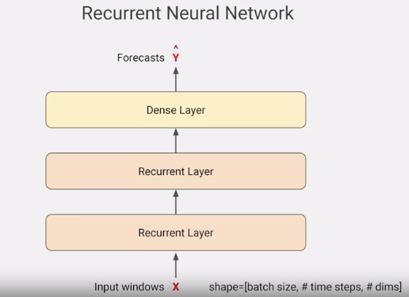

They could've been used for predicting text. Here we'll use them to process the time series. This example, will build an RNN that contains two recurrent layers and a final dense layer, which will serve as the output. With an RNN, you can feed it in batches of sequences, and it will output a batch of forecasts. The full input shape when using RNNs is 3-dimensional.

The first dimension will be the **batch size**, the second will be the **timestamps**, and the third is the **dimensionality of the inputs at each time step**.

For example, if it's a univariate time series, this value will be one, for multivariate it'll be more. The DNN model had two-dimensional inputs, the batch dimension was the first, and the second had all the input features.


There's only one cell, and it's used repeatedly to compute the outputs. In this diagram, the same one being reused multiple times by the layer. At each time step, the memory cell takes the input value for that step. For example, it is zero at time zero, and zero state input. It then calculates the output for that step, in this case `Y0`, and a state vector `H0` that's fed into the next step. `H0` is fed into the cell with `X1` to produce `Y1` and `H1`, which is then fed into the cell at the next step with `X2` to produce `Y2` and `H2`. These steps will continue until we reach the end of our input dimension, which in this case has 30 values. Now, this is what gives this type of architecture the name a recurrent neural network, because the values recur due to the output of the cell, a one-step being fed back into itself at the next time step.

This is really helpful in determining states. The location of a word in a sentence can determine it semantics. Similarly, for numeric series, things such as closer numbers in the series might have a greater impact than those further away from our target value.

## Shape of the ihnputs to the RNN

 The inputs are three dimensional.

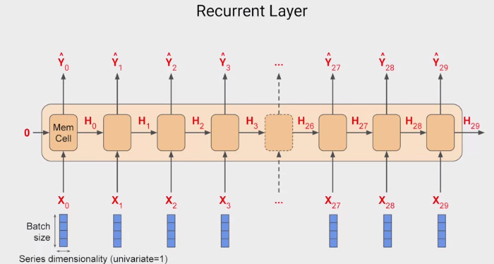

 For example, if we have a window size of 30 timestamps and we're batching them in sizes of four, the shape will be 4 times 30 times 1, and each timestamp, the memory cell input will be a four by one matrix. The cell will also take the input of the state matrix from the previous step. But of course in this case, in the first step, this will be zero. For subsequent ones, it'll be the output from the memory cell. But other than the state vector, the cell will output a `Y` value as shown below.

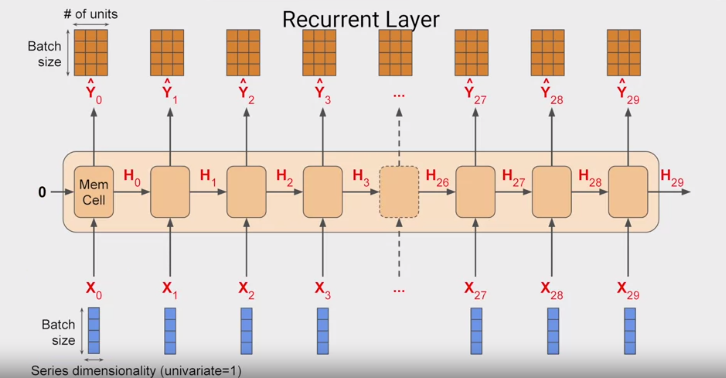

 If the memory cell is comprised of three neurons, then the output matrix will be $4\times3$ because the batch size coming in was $4$ and the number of neurons is $3$. So the full output of the layer is $3$ dimensional, in this case, $4\times30\times3$. With $4$ being **the batch size**, $3$ being **the number of units**, and $30$ being **the number of overall steps**.

 In a simple RNN, the state output `H` is just a copy of the output matrix `Y`. So for example, `H_0` is a copy of `Y_0`, `H_1` is a copy of `Y_1`, and so on. So at each timestamp, the memory cell gets both the current input and also the previous output.

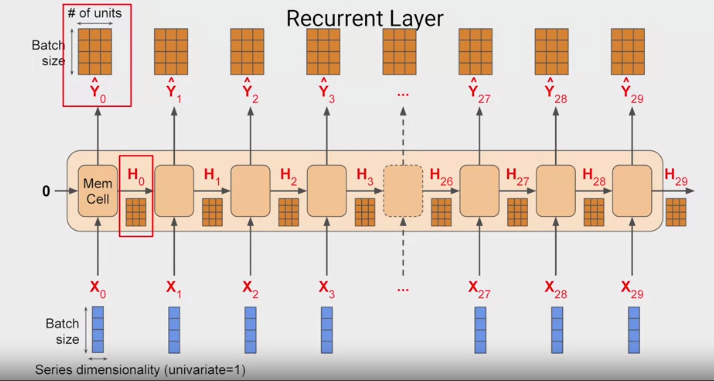

 Now, in some cases, we might want to input a sequence, but you we't want to output on and you just want to get a single vector for each instance in the batch. This is typically called a **sequence to vector RNN**.

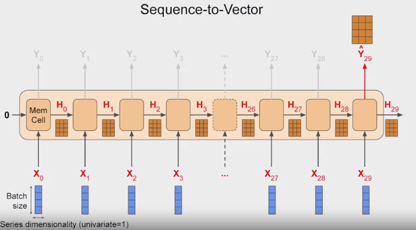

 But in reality, all we do is ignore all of the outputs, except the last one. When using Keras in TensorFlow, this is the default behavior. So if we want the recurrent layer to output a sequence, you have to specify `returns_sequences=True` when creating the layer. We need to do this when you stack one RNN layer on top of another.

## Outputting a sequences
Consider this RNN, these has two recovered layers, and the first has `return_sequences=True` set up.

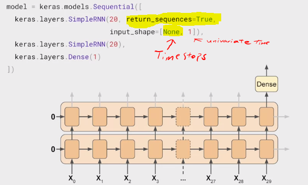

It will output a sequence which is fed to the next layer. The next layer does not have return_sequence that's set to True, so it will only output to the final step. But notice the `input_shape`, it's set to `None` and `1`. TensorFlow assumes that the first dimension is the **batch size**, and that it can have any size at all, so you don't need to define it.

Then the next dimension is **the number of timestamps**, which we can set to `None`, which means that the RNN can handle sequences of any length. The last dimension is just one because we're using a univariate time series.

This two-layer RNN that has the second one not return sequences will give us an output to a single dense.


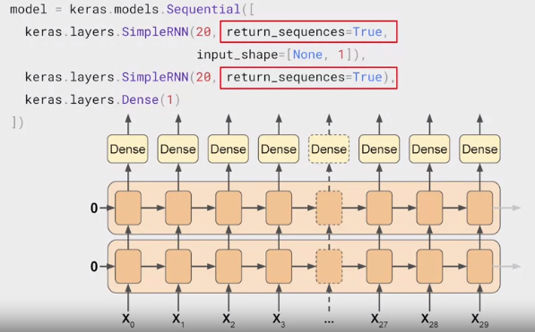

If we set `return_sequences` to `true` and all recurrent layers, then they will all output sequences and the dense layer will get a sequence as its inputs. Keras handles this by using the same dense layer independently at each time stamp.

It might look like multiple ones here but it's the same one that's being reused at each time step. This gives us what is called a sequence to sequence RNN. It's fed a batch of sequences and it returns a batch of sequences of the same length. The dimensionality may not always match. It depends on the number of units in the memory sale.

## Lambda layers

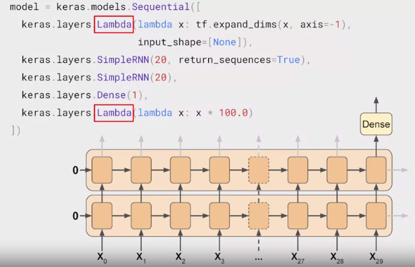

 The type of layer that use the Lambda type is one that allows us to perform arbitrary operations to effectively expand the functionality of TensorFlow's kares, and we can do this within the model definition itself. The first Lambda layer will be used to help us with our dimensionality.

 The timeseries data often comes as a 2 dimentional shape with the first being the batch size and the second the number of timestamps. But an RNN expects three-dimensions; batch size, the number of timestamps, and the series dimensionality. With the Lambda layer, we can fix this. Using the Lambda, we just expand the array by one dimension. **By setting input shape to none, we're saying that the model can take sequences of any length.** Similarly, if we scale up the outputs by 100, we can help training. The default activation function in the RNN layers is tan H which is the hyperbolic tangent activation.  This outputs values between negative one and one.

 Since the time series values are in that order usually in the 10s like 40s, 50s, 60s, and 70s, then scaling up the outputs to the same ballpark can help us with learning.

## Adjusting the learning rate dynamically

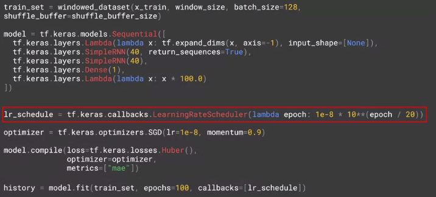

To tune the learning rate, we'll set up a callback. Every epoch this just changes the learning rate a little so that it steps all the way from 1 times 10 to the minus 8 to 1 times 10 to the minus 6.


 A loss function called Huber is added. The Huber function is a loss function that's less sensitive to outliers and as this data can get a little bit noisy, it's worth giving it a shot.

 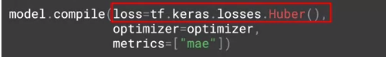

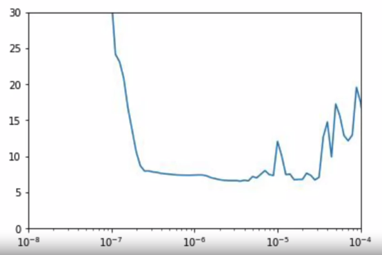
 I will see that my optimum learning rate for stochastic gradient descent is between about 10 to the minus 5 and 10 to the minus 6.

After training on 500 epoch
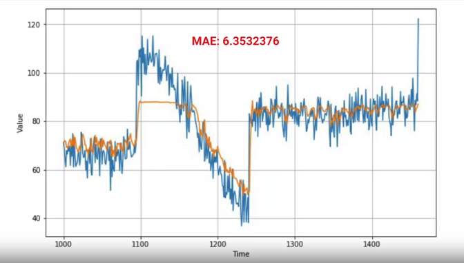

here's the loss and the MAE during training with the chart on the right is zoomed into the last few epochs. As you can see, the trend was genuinely downward until a little after 400 epochs, when it started getting unstable. Given this, it's probably worth only training for about 400 epochs.
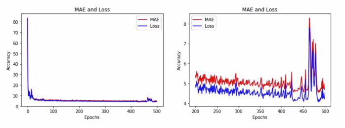

With training  on 400 epoch, we get similar MAE but we saved 100 epoch.
 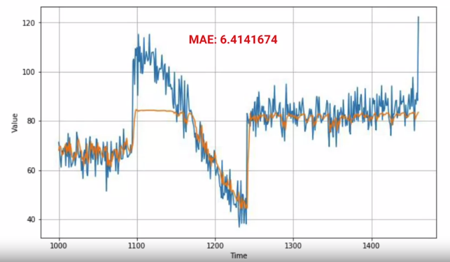

 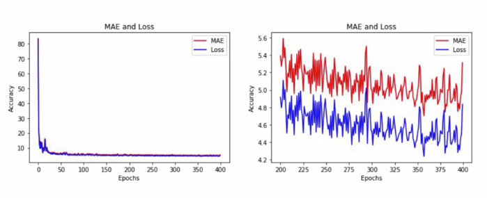

 ## Huber loss
The Huber loss function describes the penalty incurred by an estimation procedure f. Huber (1964) defines the loss function piecewise by


This function is quadratic for small values of a, and linear for large values, with equal values and slopes of the different sections at the two points where $|a|=\delta$. The variable a often refers to the residuals, that is to the difference between the observed and predicted values $a=y-f(x)$, so the former can be expanded to


## RNN

```python
!pip install tensorflow==2
```

```python
import tensorflow as tf
import numpy as np
import matplotlib.pyplot as plt
print(tf.__version__)
```
#### create a dataset
```python
def plot_series(time, series, format="-", start=0, end=None):
    plt.plot(time[start:end], series[start:end], format)
    plt.xlabel("Time")
    plt.ylabel("Value")
    plt.grid(True)

def trend(time, slope=0):
    return slope * time

def seasonal_pattern(season_time):
    """Just an arbitrary pattern, you can change it if you wish"""
    return np.where(season_time < 0.4,
                    np.cos(season_time * 2 * np.pi),
                    1 / np.exp(3 * season_time))

def seasonality(time, period, amplitude=1, phase=0):
    """Repeats the same pattern at each period"""
    season_time = ((time + phase) % period) / period
    return amplitude * seasonal_pattern(season_time)

def noise(time, noise_level=1, seed=None):
    rnd = np.random.RandomState(seed)
    return rnd.randn(len(time)) * noise_level

time = np.arange(4 * 365 + 1, dtype="float32")
baseline = 10
series = trend(time, 0.1)
baseline = 10
amplitude = 40
slope = 0.05
noise_level = 5

# Create the series
series = baseline + trend(time, slope) + seasonality(time, period=365, amplitude=amplitude)
# Update with noise
series += noise(time, noise_level, seed=42)

split_time = 1000
time_train = time[:split_time]
x_train = series[:split_time]
time_valid = time[split_time:]
x_valid = series[split_time:]

window_size = 20
batch_size = 32
shuffle_buffer_size = 1000
```

```python
def windowed_dataset(series, window_size, batch_size, shuffle_buffer):
  dataset = tf.data.Dataset.from_tensor_slices(series)
  dataset = dataset.window(window_size + 1, shift=1, drop_remainder=True)
  dataset = dataset.flat_map(lambda window: window.batch(window_size + 1))
  dataset = dataset.shuffle(shuffle_buffer).map(lambda window: (window[:-1], window[-1]))
  dataset = dataset.batch(batch_size).prefetch(1)
  return dataset
```
#### run 100 epoch to see the optimal learning rate
```python
tf.keras.backend.clear_session()
tf.random.set_seed(51)
np.random.seed(51)

train_set = windowed_dataset(x_train, window_size, batch_size=128, shuffle_buffer=shuffle_buffer_size)

model = tf.keras.models.Sequential([
  tf.keras.layers.Lambda(lambda x: tf.expand_dims(x, axis=-1),
                      input_shape=[None]),
  tf.keras.layers.SimpleRNN(40, return_sequences=True),
  tf.keras.layers.SimpleRNN(40),
  tf.keras.layers.Dense(1),
  tf.keras.layers.Lambda(lambda x: x * 100.0)
])

lr_schedule = tf.keras.callbacks.LearningRateScheduler(
    lambda epoch: 1e-8 * 10**(epoch / 20))
optimizer = tf.keras.optimizers.SGD(lr=1e-8, momentum=0.9)
model.compile(loss=tf.keras.losses.Huber(),
              optimizer=optimizer,
              metrics=["mae"])
history = model.fit(train_set, epochs=100, callbacks=[lr_schedule])
```
#### see the learning rate and the loss
```python
plt.semilogx(history.history["lr"], history.history["loss"])
plt.axis([1e-8, 1e-4, 0, 30])
```
between 10e-6 and 10e-5 so try with 5e-5
```python
tf.keras.backend.clear_session()
tf.random.set_seed(51)
np.random.seed(51)

dataset = windowed_dataset(x_train, window_size, batch_size=128, shuffle_buffer=shuffle_buffer_size)

model = tf.keras.models.Sequential([
  tf.keras.layers.Lambda(lambda x: tf.expand_dims(x, axis=-1),
                      input_shape=[None]),
  tf.keras.layers.SimpleRNN(40, return_sequences=True),
  tf.keras.layers.SimpleRNN(40),
  tf.keras.layers.Dense(1),
  tf.keras.layers.Lambda(lambda x: x * 100.0)
])

optimizer = tf.keras.optimizers.SGD(lr=5e-5, momentum=0.9)
model.compile(loss=tf.keras.losses.Huber(),
              optimizer=optimizer,
              metrics=["mae"])
history = model.fit(dataset,epochs=400)
```

```python
forecast=[]
for time in range(len(series) - window_size):
  forecast.append(model.predict(series[time:time + window_size][np.newaxis]))

forecast = forecast[split_time-window_size:]
results = np.array(forecast)[:, 0, 0]


plt.figure(figsize=(10, 6))

plot_series(time_valid, x_valid)
plot_series(time_valid, results)
```

```python
tf.keras.metrics.mean_absolute_error(x_valid, results).numpy()
```

```python
import matplotlib.image  as mpimg
import matplotlib.pyplot as plt

#-----------------------------------------------------------
# Retrieve a list of list results on training and test data
# sets for each training epoch
#-----------------------------------------------------------
mae=history.history['mae']
loss=history.history['loss']

epochs=range(len(loss)) # Get number of epochs

#------------------------------------------------
# Plot MAE and Loss
#------------------------------------------------
plt.plot(epochs, mae, 'r')
plt.plot(epochs, loss, 'b')
plt.title('MAE and Loss')
plt.xlabel("Epochs")
plt.ylabel("Accuracy")
plt.legend(["MAE", "Loss"])

plt.figure()

epochs_zoom = epochs[200:]
mae_zoom = mae[200:]
loss_zoom = loss[200:]

#------------------------------------------------
# Plot Zoomed MAE and Loss
#------------------------------------------------
plt.plot(epochs_zoom, mae_zoom, 'r')
plt.plot(epochs_zoom, loss_zoom, 'b')
plt.title('MAE and Loss')
plt.xlabel("Epochs")
plt.ylabel("Accuracy")
plt.legend(["MAE", "Loss"])

plt.figure()
```

## LSTM


 ## Coding LSTMs


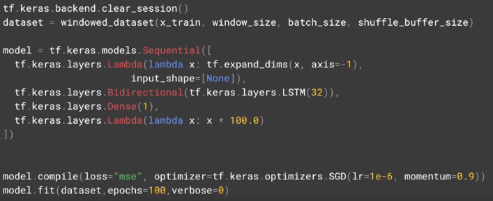

First of all is the `tf.keras.backend.clear_session`, and this clears any internal variables. That makes it easy for us to experiment without models impacting later versions of themselves.

Results:
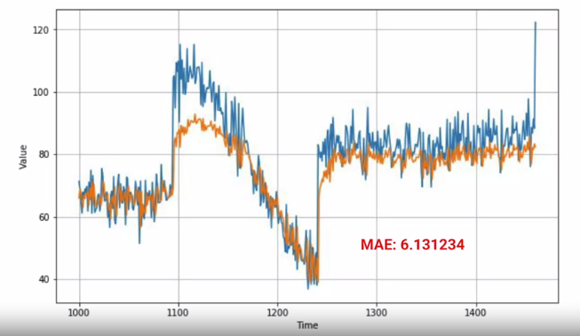

Adding one more layer of LSTM

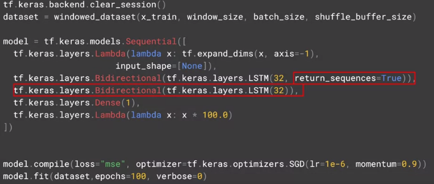

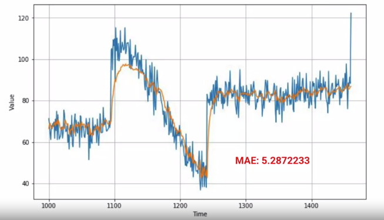

Adding third layer of LSTM

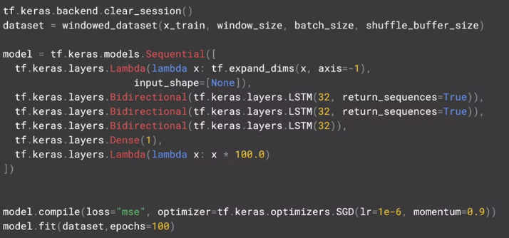

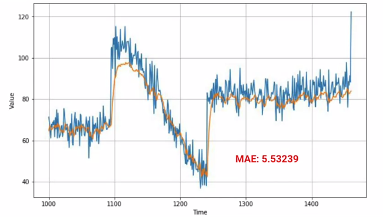

## Example of LSTM
```python
!pip install tensorflow==2.0

```
```python
import tensorflow as tf
import numpy as np
import matplotlib.pyplot as plt
print(tf.__version__)
```
### Create a dataset
```python
def plot_series(time, series, format="-", start=0, end=None):
    plt.plot(time[start:end], series[start:end], format)
    plt.xlabel("Time")
    plt.ylabel("Value")
    plt.grid(True)

def trend(time, slope=0):
    return slope * time

def seasonal_pattern(season_time):
    """Just an arbitrary pattern, you can change it if you wish"""
    return np.where(season_time < 0.4,
                    np.cos(season_time * 2 * np.pi),
                    1 / np.exp(3 * season_time))

def seasonality(time, period, amplitude=1, phase=0):
    """Repeats the same pattern at each period"""
    season_time = ((time + phase) % period) / period
    return amplitude * seasonal_pattern(season_time)

def noise(time, noise_level=1, seed=None):
    rnd = np.random.RandomState(seed)
    return rnd.randn(len(time)) * noise_level

time = np.arange(4 * 365 + 1, dtype="float32")
baseline = 10
series = trend(time, 0.1)
baseline = 10
amplitude = 40
slope = 0.05
noise_level = 5

# Create the series
series = baseline + trend(time, slope) + seasonality(time, period=365, amplitude=amplitude)
# Update with noise
series += noise(time, noise_level, seed=42)

split_time = 1000
time_train = time[:split_time]
x_train = series[:split_time]
time_valid = time[split_time:]
x_valid = series[split_time:]

window_size = 20
batch_size = 32
shuffle_buffer_size = 1000
```
```python
def windowed_dataset(series, window_size, batch_size, shuffle_buffer):
  dataset = tf.data.Dataset.from_tensor_slices(series)
  dataset = dataset.window(window_size + 1, shift=1, drop_remainder=True)
  dataset = dataset.flat_map(lambda window: window.batch(window_size + 1))
  dataset = dataset.shuffle(shuffle_buffer).map(lambda window: (window[:-1], window[-1]))
  dataset = dataset.batch(batch_size).prefetch(1)
  return dataset
```
### Identify the best learning rate
```python
tf.keras.backend.clear_session()
tf.random.set_seed(51)
np.random.seed(51)

tf.keras.backend.clear_session()
dataset = windowed_dataset(x_train, window_size, batch_size, shuffle_buffer_size)

model = tf.keras.models.Sequential([
  tf.keras.layers.Lambda(lambda x: tf.expand_dims(x, axis=-1),
                      input_shape=[None]),
  tf.keras.layers.Bidirectional(tf.keras.layers.LSTM(32, return_sequences=True)),
  tf.keras.layers.Bidirectional(tf.keras.layers.LSTM(32)),
  tf.keras.layers.Dense(1),
  tf.keras.layers.Lambda(lambda x: x * 100.0)
])

lr_schedule = tf.keras.callbacks.LearningRateScheduler(
    lambda epoch: 1e-8 * 10**(epoch / 20))
optimizer = tf.keras.optimizers.SGD(lr=1e-8, momentum=0.9)
model.compile(loss=tf.keras.losses.Huber(),
              optimizer=optimizer,
              metrics=["mae"])
history = model.fit(dataset, epochs=100, callbacks=[lr_schedule])
```
```python
plt.semilogx(history.history["lr"], history.history["loss"])
plt.axis([1e-8, 1e-4, 0, 30])
```
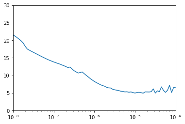

```python
plt.semilogx(history.history["lr"], history.history["loss"])
plt.axis([1e-5, 1e-4, 0, 10])
```
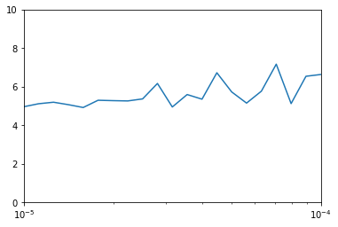

1e-5 is probably the best lr.
```python
tf.keras.backend.clear_session()
tf.random.set_seed(51)
np.random.seed(51)

tf.keras.backend.clear_session()
dataset = windowed_dataset(x_train, window_size, batch_size, shuffle_buffer_size)

model = tf.keras.models.Sequential([
  tf.keras.layers.Lambda(lambda x: tf.expand_dims(x, axis=-1),
                      input_shape=[None]),
   tf.keras.layers.Bidirectional(tf.keras.layers.LSTM(32, return_sequences=True)),
  tf.keras.layers.Bidirectional(tf.keras.layers.LSTM(32)),
  tf.keras.layers.Dense(1),
  tf.keras.layers.Lambda(lambda x: x * 100.0)
])


model.compile(loss="mse", optimizer=tf.keras.optimizers.SGD(lr=1e-5, momentum=0.9),metrics=["mae"])
history = model.fit(dataset,epochs=500,verbose=0)
```
```python
forecast = []
results = []
for time in range(len(series) - window_size):
  forecast.append(model.predict(series[time:time + window_size][np.newaxis]))

forecast = forecast[split_time-window_size:]
results = np.array(forecast)[:, 0, 0]


plt.figure(figsize=(10, 6))

plot_series(time_valid, x_valid)
plot_series(time_valid, results)
```
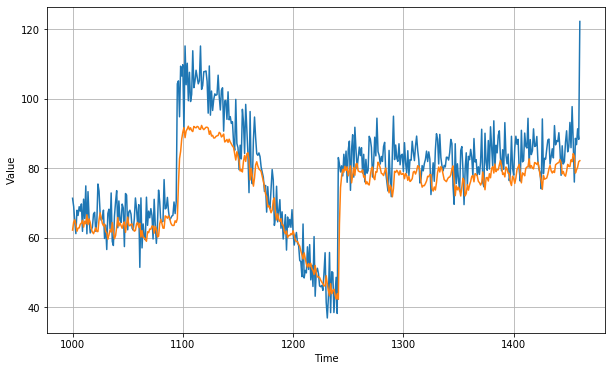
```python
tf.keras.metrics.mean_absolute_error(x_valid, results).numpy()
```
6.6017175
```python
import matplotlib.image  as mpimg
import matplotlib.pyplot as plt

#-----------------------------------------------------------
# Retrieve a list of list results on training and test data
# sets for each training epoch
#-----------------------------------------------------------
mae=history.history['mae']
loss=history.history['loss']

epochs=range(len(loss)) # Get number of epochs

#------------------------------------------------
# Plot MAE and Loss
#------------------------------------------------
plt.plot(epochs, mae, 'r')
plt.plot(epochs, loss, 'b')
plt.title('MAE and Loss')
plt.xlabel("Epochs")
plt.ylabel("Accuracy")
plt.legend(["MAE", "Loss"])

plt.figure()

epochs_zoom = epochs[200:]
mae_zoom = mae[200:]
loss_zoom = loss[200:]

#------------------------------------------------
# Plot Zoomed MAE and Loss
#------------------------------------------------
plt.plot(epochs_zoom, mae_zoom, 'r')
plt.plot(epochs_zoom, loss_zoom, 'b')
plt.title('MAE and Loss')
plt.xlabel("Epochs")
plt.ylabel("Accuracy")
plt.legend(["MAE", "Loss"])

plt.figure()
```
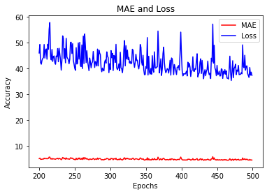
```python
tf.keras.backend.clear_session()
dataset = windowed_dataset(x_train, window_size, batch_size, shuffle_buffer_size)

model = tf.keras.models.Sequential([
  tf.keras.layers.Lambda(lambda x: tf.expand_dims(x, axis=-1),
                      input_shape=[None]),
  tf.keras.layers.Bidirectional(tf.keras.layers.LSTM(32, return_sequences=True)),
  tf.keras.layers.Bidirectional(tf.keras.layers.LSTM(32)),
  tf.keras.layers.Dense(1),
  tf.keras.layers.Lambda(lambda x: x * 100.0)
])


model.compile(loss="mse", optimizer=tf.keras.optimizers.SGD(lr=1e-6, momentum=0.9))
model.fit(dataset,epochs=100, verbose=0)
```

```Python
tf.keras.backend.clear_session()
dataset = windowed_dataset(x_train, window_size, batch_size, shuffle_buffer_size)

model = tf.keras.models.Sequential([
  tf.keras.layers.Lambda(lambda x: tf.expand_dims(x, axis=-1),
                      input_shape=[None]),
  tf.keras.layers.Bidirectional(tf.keras.layers.LSTM(32, return_sequences=True)),
  tf.keras.layers.Bidirectional(tf.keras.layers.LSTM(32, return_sequences=True)),
  tf.keras.layers.Bidirectional(tf.keras.layers.LSTM(32)),
  tf.keras.layers.Dense(1),
  tf.keras.layers.Lambda(lambda x: x * 100.0)
])


model.compile(loss="mse", optimizer=tf.keras.optimizers.SGD(lr=1e-6, momentum=0.9))
model.fit(dataset,epochs=100)
```
